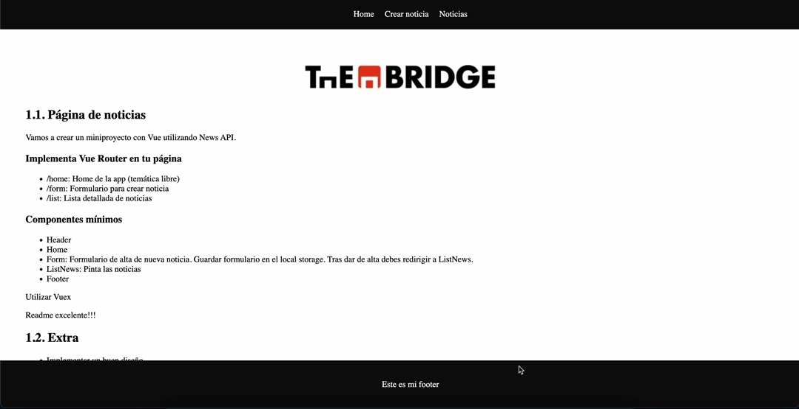

# News Page Project with Vue.js

This project utilizes Vue.js and the News API to create a news web page. It implements Vue Router for navigating between different sections of the page.

## Functionalities

- **Home (/home):** Main page of the application with a free theme.
- **Form (/form):** Form for creating a new piece of news.
- **List (/list):** Detailed list of news.

## Minimum Components

The project consists of the following minimum components:

- **Header:** Page header.
- **Home:** Main page.
- **Form:** Form for adding a new piece of news.
- **ListNews:** News list.
- **Footer:** Page footer.

## Using Vuex

Vuex is used for managing the application's state.

## Extras

Implemented features include:

- **Attractive Design:** A visually appealing design has been worked on.
- **Responsiveness:** The page adapts to different devices.

## Local Storage

News created through the form are stored in the browser's local storage.

## Preview

  

  <!--VUE-->
  

